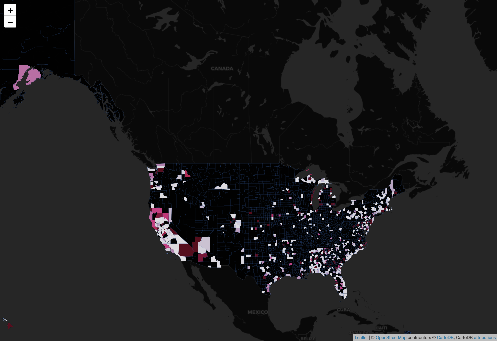

# UMD Data Challange 2020 - Ocean Clean Up

### [Github Page of the Project](https://maksimekin.github.io/umd_data_challange_2020/)
 

## Dataset General Statistics

  

 

  

 

  

 

  

 

  

 

## [Time Lapse Trash Collection Map](https://maksimekin.github.io/umd_data_challange_2020/plots/map.html)

  

 

## [Collected Trash in Pounds Heatmap](https://maksimekin.github.io/umd_data_challange_2020/plots/map_2.html)

  

 

## Dataset Corelation Table

  

 

## Pieces of Trash Collected Scatter Plot

  

## Miles Covered by State

  

 

## Pieces of Trash Collected by the Children Volunteers

  

 

## Pounds of Trash Collected by State

  

 

## Types of Trash Frequency

  

 
