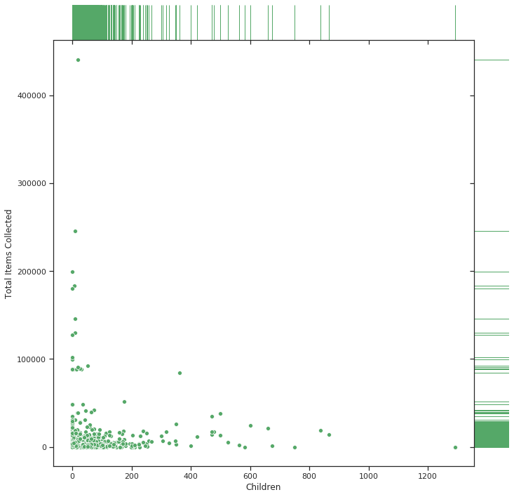

# UMD Data Challange 2020 - Ocean Clean Up

### [Homepage](https://maksimekin.github.io/umd_data_challange_2020/)  --- [Zone Clean Up Map](https://maksimekin.github.io/umd_data_challange_2020/plots/map_2.html) --- [Time Lapse Map](https://maksimekin.github.io/umd_data_challange_2020/plots/map.html)

  

  

  

  

  

  

  

  

