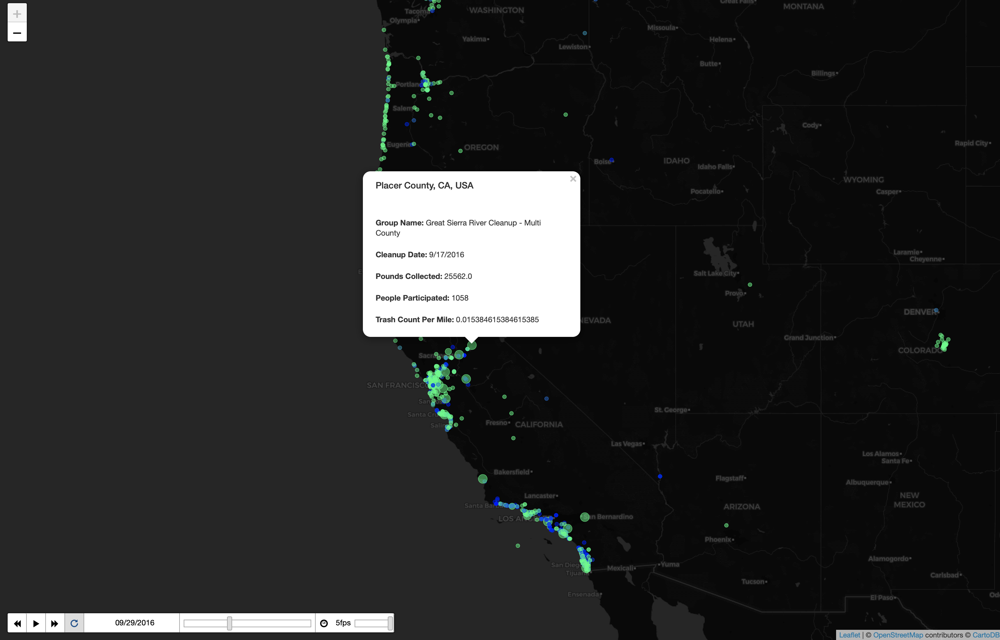
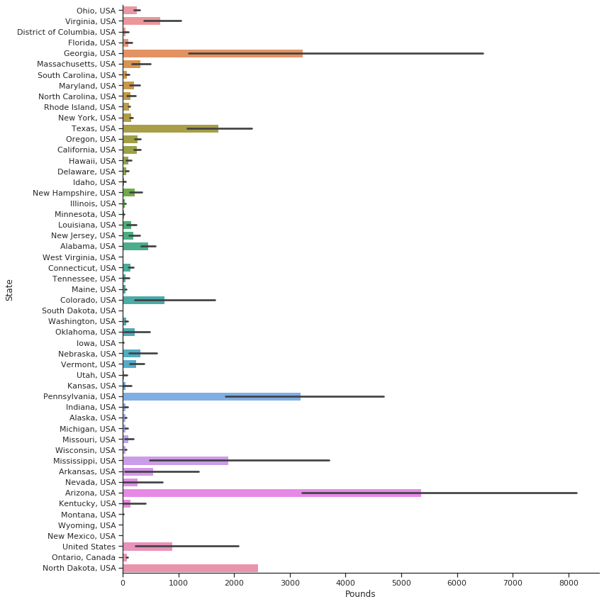

# UMD Data Challange 2020 - Ocean Clean Up

  

 

71% of the Earth’s surface is covered by oceans. This is an easily forgettable truth for many individuals whose most frequent encounter with oceans comes through a desktop wallpaper. The oceans are humanity’s greatest resource and they are hurting. Our project attempts to analyze the Booz Allen Hamilton Ocean Cleanup data in order to assess cleanup activity, optimize the effort, and possibly predict future cleanup needs.
  
The given dataset was collected from an app that allowed people to self-report cleanup projects. There are approximately 38,000 recorded cleanup operations. Grouped by date, each record could be examined for location, trash content, number of people involved, and much more. Our main tool for the task was Python and the many data processing libraries that come with it. To get a good idea of our data, we broke it down graphically including time series plots of participation, correlations between different data points, comparisons of trash frequency, etc. This process gave us an idea of what type of trash and which areas were most problematic.
  
To further our understanding, the group looked at other datasets such as estimated concentrations of plastic in the oceans and area-specific environmental conditions. This data was interpolated with the original dataset. We also wanted to know which areas are prone to which types of trash. For this task, we trained a machine learning model to predict the likeliest trash content for a certain location on a given date.
Whether it is a sea turtle with 6 pack rings as a necklace or a beach goer stepping on discarded glass, the effects of ocean pollution are readily apparent. If we hope to sustain the world’s largest resource, action must be taken. Our project attempts to show the current state of the cleanup effort and some possible ways to optimize the process in the future.
  
**[UMD Data Challange](https://datachallenge.ischool.umd.edu)**
  

## Dataset General Statistics

  

 

  

 

  

 

  

 

  

 

  

 

## [Time Lapse Trash Collection Map](https://maksimekin.github.io/umd_data_challange_2020/maps/time_lapse.html)

  

  

 

## [Collected Trash in Pounds Heatmap](https://maksimekin.github.io/umd_data_challange_2020/maps/heat_map.html)

  

 

## [Combining Different Datasets with the Ocean Clean Up Dataset](https://maksimekin.github.io/umd_data_challange_2020/maps/combined_data.html)

**Ocean Surface Debris Data:** 
>Plastic marine debris data (mass of particles g per km2) collected with a plankton net with 200 micron mesh

Cózar , A., F. Echevarría, J. I. González-Gordillo, X. Irigoien, B. Úbeda, S. Hernández-León, Á. T. Palma, S. Navarro, J. García-de-Lomas, A. Ruiz, M. L. Fernández-de-Puelles and C. M. Duarte (2014). "Plastic debris in the open ocean." Proceedings of the National Academy of Sciences, 111 10239-10244.  

[Global sampling of ocean debris data](http://onesharedocean.org/data#276)

  

**Tampa Bay Natural Trash Collection Areas:**

>These locations were identified as natural collection points, which under certain environmental conditions can be considered marine debris hot spots. The points listed in these data, represent larger segments of shoreline where marine debris or other floating sargassum may be directed through wind and tidal forces. These locations were identified through the use of satellite imagery, a Tampa Bay specific Estuary, Coastal and Ocean Circulation Model (ECOM), beach cleanup data and fish kills reported to FWC by the public

[Natural Collection Areas of Tampa Bay](https://hub.arcgis.com/datasets/myfwc::natural-collection-areas-of-tampa-bay-)

  

## Dataset Corelation Table

  

 

## Pieces of Trash Collected Scatter Plot

  

## Miles Covered by State

  

 

## Pieces of Trash Collected by the Children Volunteers

  

 

## Pounds of Trash Collected by State

  

 

## Types of Trash Frequency

  

 

 

  

 
