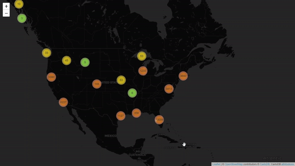
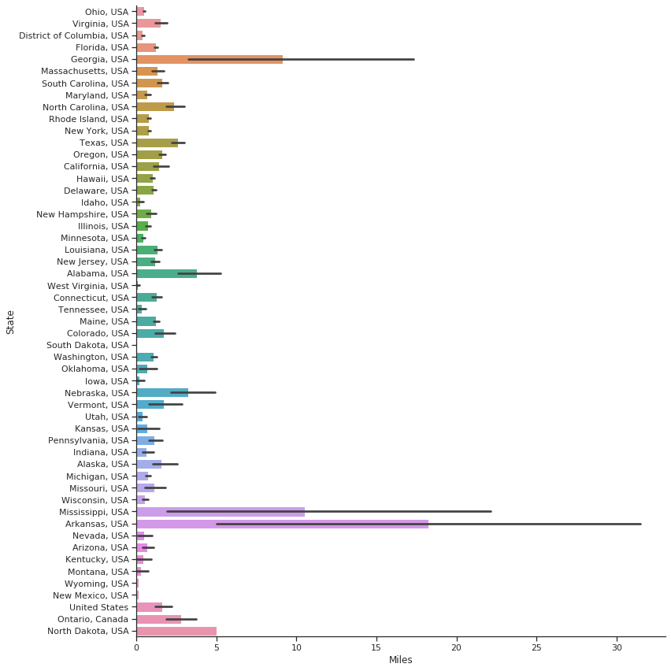

# UMD Data Challange 2020 - Ocean Clean Up
### Winning Categories
- Most Innovative Project
- Outstanding UMBC Project

  

 
 

### Ocean Clean Up Data Analysis

  

 

71% of the Earth’s surface is covered by oceans. This is an easily forgettable truth for many individuals whose most frequent encounter with oceans comes through a desktop wallpaper. The oceans are humanity’s greatest resource and they are hurting. Our project attempts to analyze the Booz Allen Hamilton Ocean Cleanup data in order to assess cleanup activity, optimize the effort, and possibly predict future cleanup needs.
  
The given dataset was collected from an app that allowed people to self-report cleanup projects. There are approximately 38,000 recorded cleanup operations. Grouped by date, each record could be examined for location, trash content, number of people involved, and much more. Our main tool for the task was Python and the many data processing libraries that come with it. To get a good idea of our data, we broke it down graphically including time series plots of participation, correlations between different data points, comparisons of trash frequency, etc. This process gave us an idea of what type of trash and which areas were most problematic.
  
To further our understanding, the group looked at other datasets such as estimated concentrations of plastic in the oceans and area-specific environmental conditions. This data was interpolated with the original dataset. We also wanted to know which areas are prone to which types of trash. For this task, we trained a machine learning model to predict the likeliest trash content for a certain location on a given date.
Whether it is a sea turtle with 6 pack rings as a necklace or a beach goer stepping on discarded glass, the effects of ocean pollution are readily apparent. If we hope to sustain the world’s largest resource, action must be taken. Our project attempts to show the current state of the cleanup effort and some possible ways to optimize the process in the future.
  
**[UMD Data Challange](https://datachallenge.ischool.umd.edu)** (Team DC20065)
  

## Dataset General Statistics

  

The coastline cleanup effort has some momentum behind it as shown by the high participation rates. Some level of cleanup has been attempted and recorded in all 50 states. Even landlocked states have participated by cleaning up rivers and other localized bodies of water.

 

  

 

  

Almost 12 million pounds of trash have been removed through this effort. This equates to the weight of about 3600 midsize sedans. All this trash has been picked up, bagged, and removed from bodies of water. This statistic sounds impressive until you realize that the experts estimate that [14 billion pounds of trash](http://seastewards.org/projects/healthy-oceans-initiative/marine-debris-and-plastics/) is dumped into the oceans every year. At this rate the cleanup effort would need to be multiplied by a factor of 3500 to keep up.

 

  

The recorded cleanup operations have covered 54,000 miles of shoreline. For context, the circumference of the Earth is  24,901 miles. This means that volunteers have essentially traversed the Earth twice collecting trash.

 

  

With almost 20 million pieces of trash being collected, this is enough items to fill 489 fully-stocked grocery stores. In fact, much of the trash found in the oceans originated from such stores. Plastic water bottles, food wrappers, and grocery bags are some of the most common pollutants covering the shorelines.

 

  

The carbon footprint of plastic (LDPE or PET, poyethylene) is about 6 kg CO2 per kg of plastic. The plastic bags collected from the U.S shorelines had a carbon footprint equivalent to that of a power plant running for two days non-stop. This isn’t even the worst offence for plastic bags. Sea creatures often confuse the bags for food; a great example is the sea turtle. Plastic bags floating underwater look like jellyfish, sea turtles eat jellyfish, which means sea turtles are regularly eating plastic bags by mistake. In fact a study done by the EPA showed that more that 50% of dead turtles have plastic bags in their stomachs. The bags block their digestive tracks and the buoyancy forces them to float, making it impossible for them to dive for food-they therefore starve to death.    

[Plastic bags and plastic bottles – CO2 emissions](https://timeforchange.org/plastic-bags-and-plastic-bottles-co2-emissions-during-their-lifetime/)  
[Devastating Effects of Plastic Bags on Marine Life](https://americandisposal.com/blog/devastating-effects-of-plastic-bags-on-marine-life/)

 

  

**Cost of Cleaning the Ocean:**
- Cost/Value of a volunteer: $ 25.43 ([Value of Volunteer](https://independentsector.org/news-post/new-value-volunteer-time-2019/))
- Total people participated: 721697
- Volunteering hours on average person/year in the USA: 32.1 ([Average Volunteering Hours](https://www.huffpost.com/entry/america-does-not-have-eno_b_9032152))

 

  

 

## [Time Lapse Trash Collection Map](https://maksimekin.github.io/umd_data_challange_2020/maps/time_lapse.html)

  

  

 

[See the Time-Lapse Map Here](https://maksimekin.github.io/umd_data_challange_2020/maps/time_lapse.html)

## [Collected Trash in Pounds Heatmap](https://maksimekin.github.io/umd_data_challange_2020/maps/heat_map.html)

  

 

[See the Trash Heatmap Map Here](https://maksimekin.github.io/umd_data_challange_2020/maps/heat_map.html)

## Combining Different Datasets with the Ocean Clean Up Dataset

**Ocean Surface Debris Data:** 
>Plastic marine debris data (mass of particles g per km2) collected with a plankton net with 200 micron mesh

Cózar , A., F. Echevarría, J. I. González-Gordillo, X. Irigoien, B. Úbeda, S. Hernández-León, Á. T. Palma, S. Navarro, J. García-de-Lomas, A. Ruiz, M. L. Fernández-de-Puelles and C. M. Duarte (2014). "Plastic debris in the open ocean." Proceedings of the National Academy of Sciences, 111 10239-10244.  

[Global sampling of ocean debris data](http://onesharedocean.org/data#276)

  

[See the Ocean Debris Combined Data Map Here](https://maksimekin.github.io/umd_data_challange_2020/maps/ocean_debris_combined_map.html)

**Tampa Bay Natural Trash Collection Areas:**

>These locations were identified as natural collection points, which under certain environmental conditions can be considered marine debris hot spots. The points listed in these data, represent larger segments of shoreline where marine debris or other floating sargassum may be directed through wind and tidal forces. These locations were identified through the use of satellite imagery, a Tampa Bay specific Estuary, Coastal and Ocean Circulation Model (ECOM), beach cleanup data and fish kills reported to FWC by the public

[Natural Collection Areas of Tampa Bay](https://hub.arcgis.com/datasets/myfwc::natural-collection-areas-of-tampa-bay-)

  

 

  

 

[See Tampa Bay Natural Trash Collection Areas Combined Map Here](https://maksimekin.github.io/umd_data_challange_2020/maps/tampa_bay_combined_map.html)                                             
                                                         
**Sea Turtle Population:**
                                                         
>This data set contains sea turtle length and weight measurements, sex ratios, species composition, capture and release locations, tagging information, and information on biological samples collected for loggerhead, green, and Kemp's Ridley sea turtle populations in the coastal waters of North Carolina.   
       
[Sea turtle population study in the coastal waters of North Carolina](https://catalog.data.gov/dataset/sea-turtle-population-study-in-the-coastal-waters-of-north-carolina-from-1988-06-07-to-2015-09-)

  

                                                         
[See the Sea Turtle Population Combined Map Here](https://maksimekin.github.io/umd_data_challange_2020/maps/sea_turtles_combined_map.html)                                         

## Dataset Corelation Table

  

 

## Pieces of Trash Collected Scatter Plot

  

## Miles Covered by State

  

 

## Pieces of Trash Collected by the Children Volunteers

  

 

## Pounds of Trash Collected by State

  

 

## Types of Trash Frequency

  

 

## Clustering Trash Types    
#### Simple correlation matrix of different trash types. No clustering attempted 

  

 

#### Hierarchical clustering to determine which trash groups belongs to which cluster 

  

 

#### Two pass clustering on trash types. Items closer together in the table are now more likely to be found together  

  

 
 
 

## Interface for classification model that predicts most likely trash item by location

  

 
 
 

  

 
